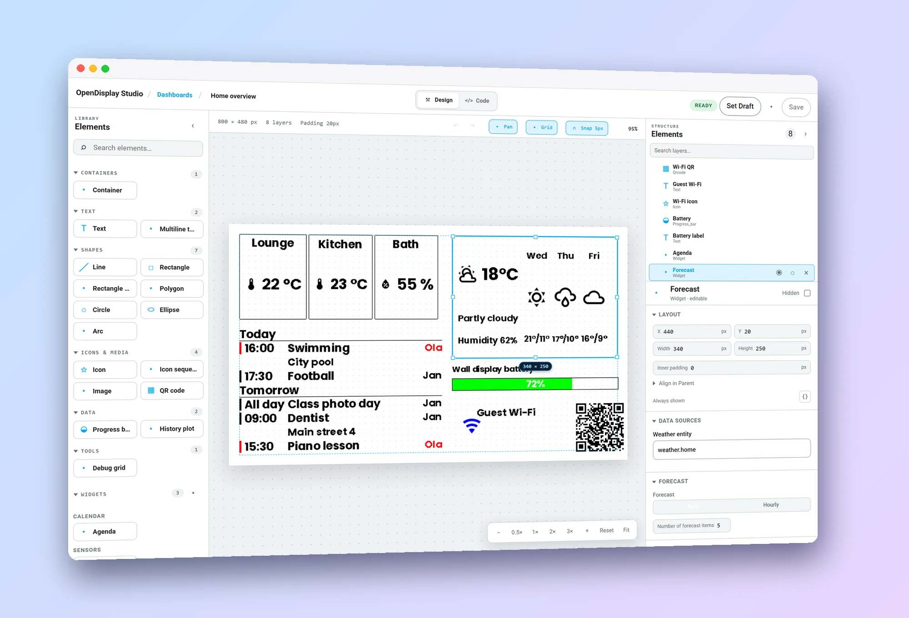
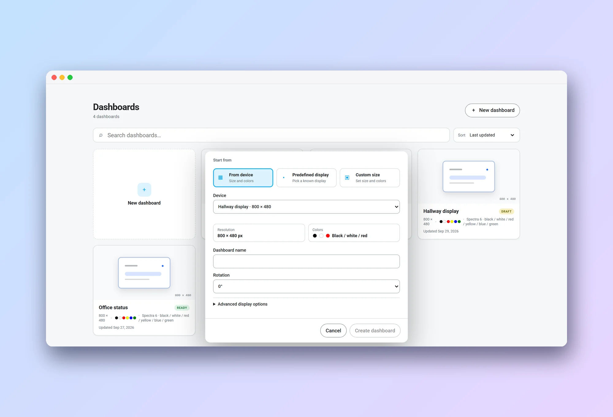
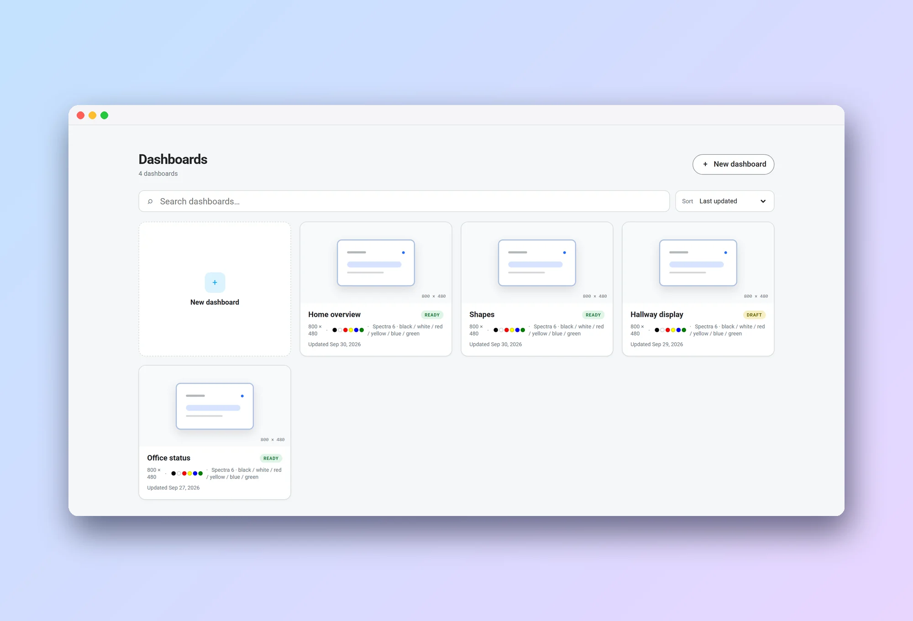
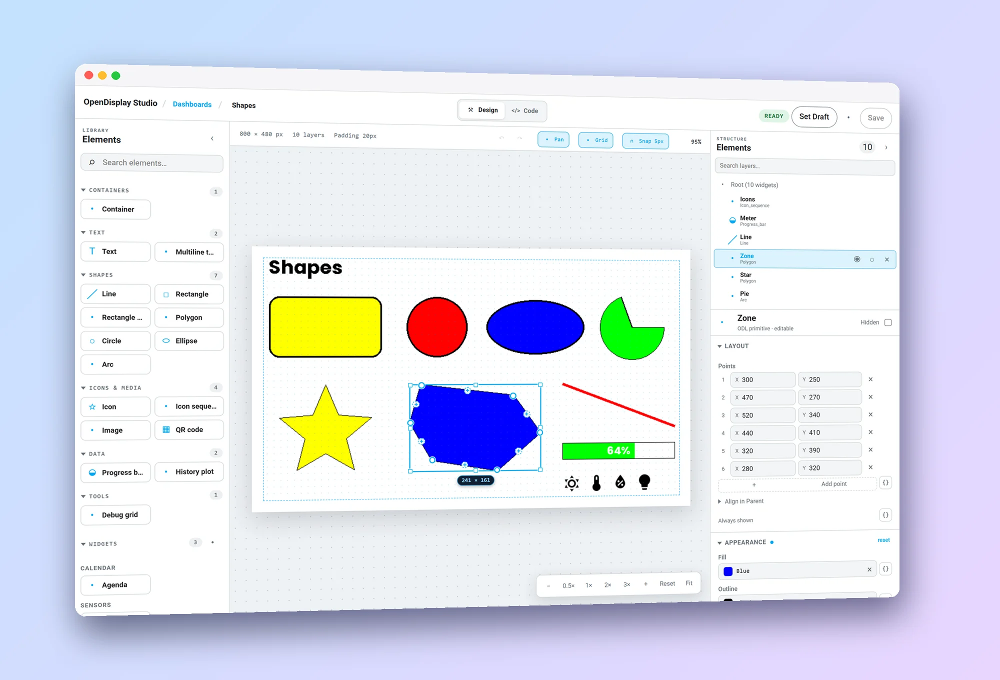
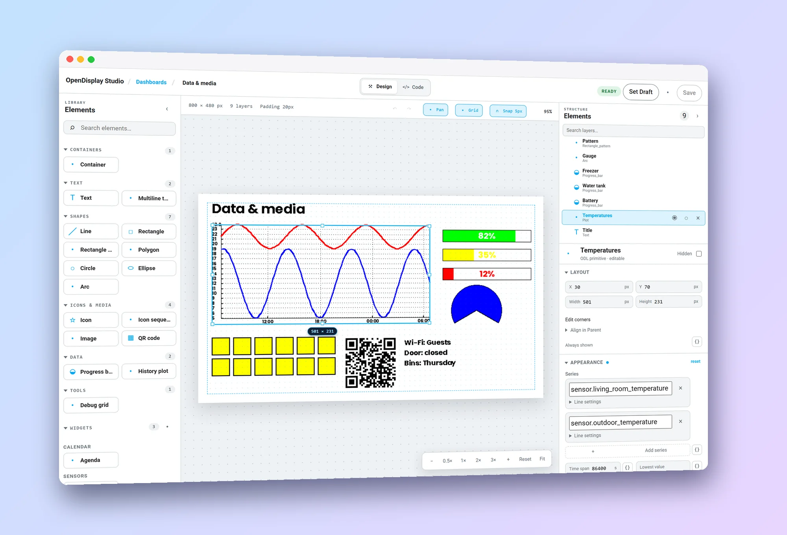
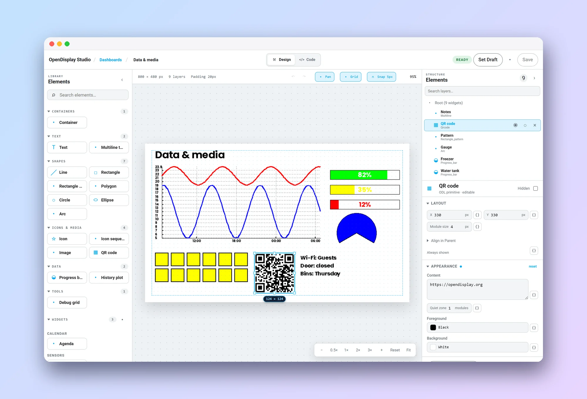
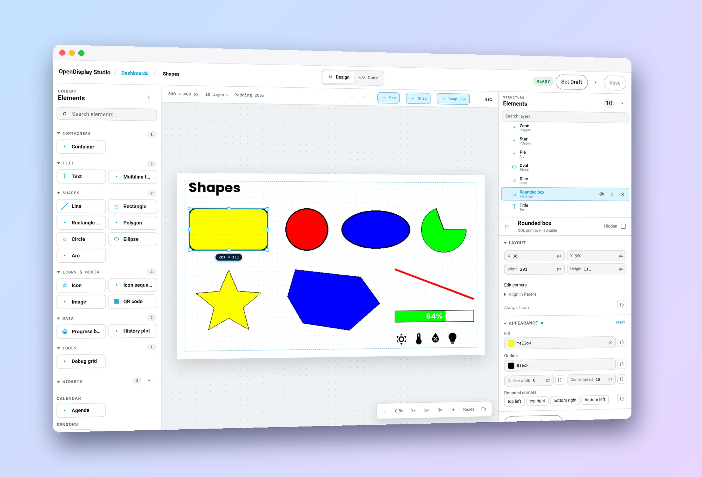
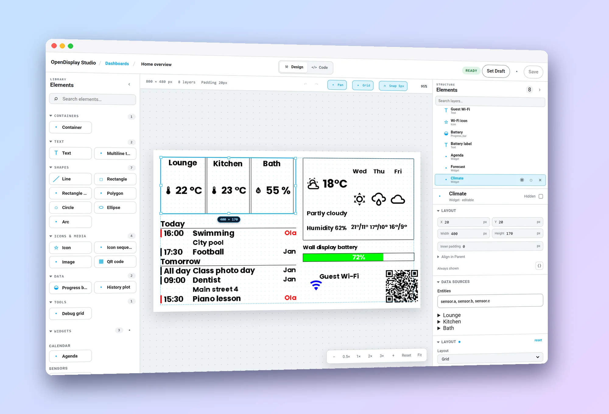
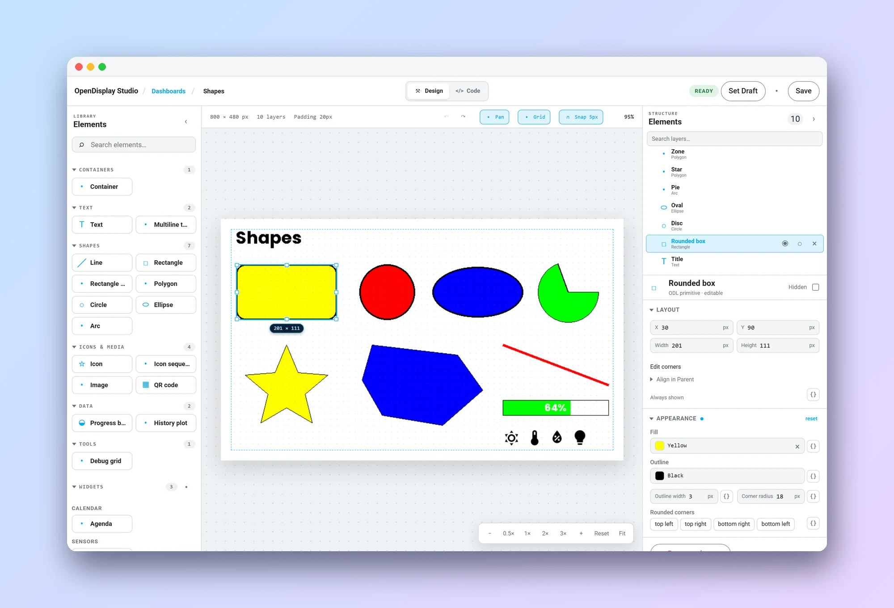
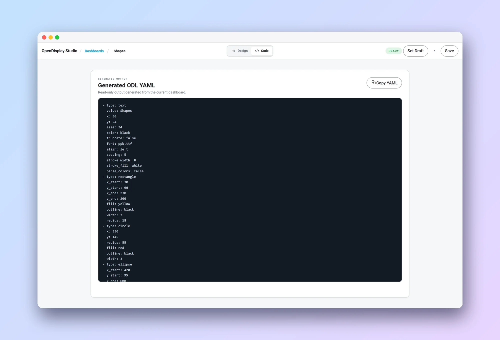

# OpenDisplay Studio

**Design e-paper screens inside Home Assistant.** Drag shapes, text, icons and
live widgets onto a canvas that is exactly the size of your display, bind any
property to Home Assistant data, and send the result to an
[OpenDisplay](https://opendisplay.org) device, or serve it as an image that any
display can fetch.

[](https://my.home-assistant.io/redirect/hacs_repository/?owner=Misiu&repository=OpenDisplay-Studio-Integration&category=integration)
[](https://my.home-assistant.io/redirect/config_flow_start/?domain=opendisplay_studio)

<p align="center">
  
</p>

## What you get

- **A real WYSIWYG editor.** The picture on the canvas is rendered by the same
  engine that produces the final image, so what you see is what the display
  shows: same fonts, same palette, same pixels.
- **Every OpenDisplay drawing type**: text, multiline text, lines, rectangles,
  patterns, polygons, circles, ellipses, arcs, icons, icon rows, images, QR
  codes, progress bars, history plots and a debug grid.
- **Live widgets**: Sensor card, Sensor list, Sensor chart, Agenda and Weather read
  your entities, calendars and forecasts. Write your own widget as a small Python package (see
  [`docs/widget-sdk.md`](docs/widget-sdk.md)).
- **Your data in any property.** Switch the `{}` toggle next to a field and
  type a Home Assistant template. The panel re-renders when the entities it
  reads change.
- **Made for e-paper.** Pick the colours of your display (black/white,
  red, yellow, Spectra 6, grayscale…); the colour pickers only offer what the
  panel can show.

## Start from the display you own

Create a dashboard from a display Home Assistant already knows, from a list of
common panels, or at any custom size. Rotation is part of the dashboard, so a
portrait display just works.

<p align="center">
  
</p>

All your dashboards live in one list, with their size, colours and state
(Draft or Ready). Ready dashboards get a stable image address; send them to a
device with one click.

<p align="center">
  
</p>

## Shapes you can shape

Select a polygon and drag its points. Click the **+** on an edge to add a point,
double-click a point to remove it. A line has a handle on each end. Everything
snaps to the grid and to the edges and centres of its neighbours, and guides
with equal-gap badges show you when things line up. Hold <kbd>Ctrl</kbd> to
turn snapping off, press <kbd>Esc</kbd> to cancel a drag.

<p align="center">
  
</p>

## Charts, gauges, codes and patterns

The more advanced drawing types are as easy to use as a rectangle. A **history
plot** draws the recorded history of up to four entities, each with its own
colour, line width and smoothing, optional axes and labels, and a multiplier for
values that need scaling. Pick the entity of every series from the usual Home
Assistant entity picker. Progress bars, arcs, QR codes, repeating patterns,
rows of icons and multiline text sit next to them in the library.

<p align="center">
  
</p>

<p align="center">
  
</p>

## One panel for every element

Primitives, widgets and containers are edited with the same compact controls:
numbers with units, segmented choices, colour swatches limited to your
display's palette, a searchable picker for every Material Design icon, an image
picker, and an entity picker for each series of a history plot. Sections show a dot when something differs from the defaults
and a **reset** link puts it back in one step; rarely needed fields wait under
**Advanced**.

<p align="center">
  
</p>

## Widgets

Widgets decide *how* to lay out your data; you decide *what* to show. Pick the
entities, calendars or weather source, choose the options, and resize the frame.
The layout adapts to the size you give it. Every widget can be drawn without its
frame and background, or in white on black. [The widgets page](docs/widgets/README.md)
lists each widget with its sources, options and pictures.

<p align="center">
  
</p>

## Undo, redo and a safety net

Every change is one undo step: moving, resizing, typing a value, ordering,
grouping, pasting. Drag and nudge bursts are grouped sensibly, and
<kbd>Esc</kbd> abandons a gesture without leaving a trace.

<p align="center">
  
</p>

## See the code

The **Code** view shows the clean, flat ODL YAML that is generated from the
dashboard: absolute coordinates, only valid fields, nothing else. Copy it into
an automation if you prefer to drive a display yourself.

<p align="center">
  
</p>

## Move a design between dashboards

**Export** saves the open dashboard as a JSON file; **Import** replaces the
elements of the open dashboard with those of such a file, keeping its name, id
and display settings. If the file was made for a display with more colours than
yours, the import lists the colours your palette lacks and lets you pick a
colour of your own for each; colours both displays have are kept. An import is
one undo step and is not saved until you save.

## Working with the canvas

| Do this | To get this |
|---|---|
| Mouse wheel | Pan |
| <kbd>Ctrl</kbd> / <kbd>⌘</kbd> + wheel | Zoom toward the pointer |
| Middle button, or <kbd>Space</kbd> + drag | Move the view |
| <kbd>Shift</kbd> + click | Add to the selection |
| Arrow keys, <kbd>Shift</kbd> + arrow | Nudge by 1 px, or by the grid size |
| <kbd>Ctrl</kbd> + <kbd>G</kbd> | Group the selection |
| <kbd>Ctrl</kbd> + <kbd>D</kbd>, <kbd>Ctrl</kbd> + <kbd>C</kbd> / <kbd>V</kbd> | Duplicate, copy and paste |
| <kbd>Ctrl</kbd> + <kbd>Z</kbd> / <kbd>Y</kbd> | Undo and redo |

Press <kbd>?</kbd> in the editor for the complete list. Elements may hang out of
the canvas; the renderer simply draws what is in view.

## How it works

```text
Home Assistant data
        ↓
dashboard (a tree of shapes, containers and widgets)
        ↓
ODL elements with absolute coordinates
        ↓
odl-renderer
        ↓
exact-size PNG
        ↓
editor preview, Media Source, or your device
```

The integration embeds `odl-renderer`:
no add-on, no browser, no extra service. The editor preview and the image your
display receives come from the same code path.

Every Ready dashboard has a stable address:

```text
media-source://opendisplay_studio/<dashboard-id>
```

### Fonts

Text uses the two fonts that ship with the renderer. To use your own, put
`.ttf` or `.otf` files in `/config/opendisplay_studio/fonts/`; they appear in the
font lists of the editor.

## Installation

1. Click **Open this integration in HACS**, download OpenDisplay Studio, and
   restart Home Assistant when requested.
2. Click **Add OpenDisplay Studio to Home Assistant**.
3. Open **OpenDisplay Studio** in the Home Assistant sidebar.

It works on Home Assistant OS, Supervised, Container and Core.

## Development

```bash
python -m pip install -r requirements_test.txt
python -m ruff check .
python -m ruff format --check .
python -m mypy custom_components/opendisplay_studio scripts
python -m pytest

cd frontend-src
npm ci
npm test
npm run build
npm run test:e2e
```

See [ARCHITECTURE.md](ARCHITECTURE.md) for the render boundary,
[WIDGET_CONTRACT.md](WIDGET_CONTRACT.md) for the widget contract and
[ROADMAP.md](ROADMAP.md) for what is done and what is next.

## License

MIT
