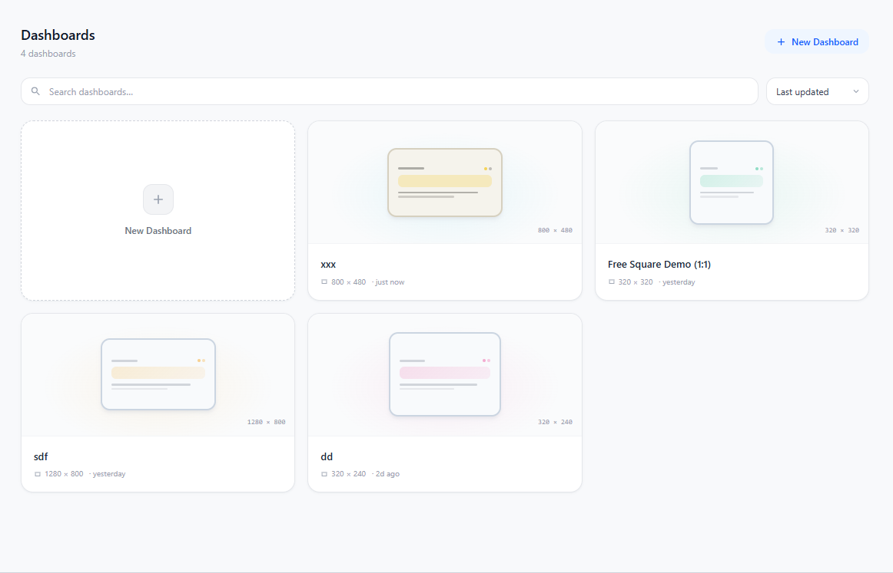
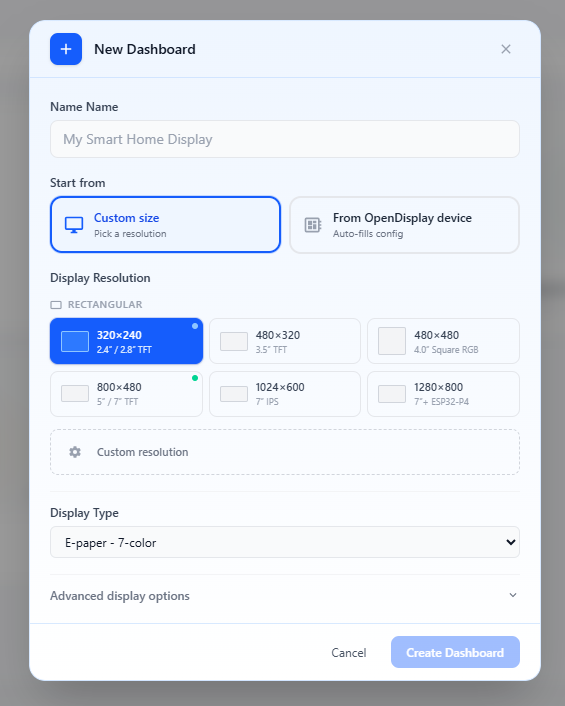
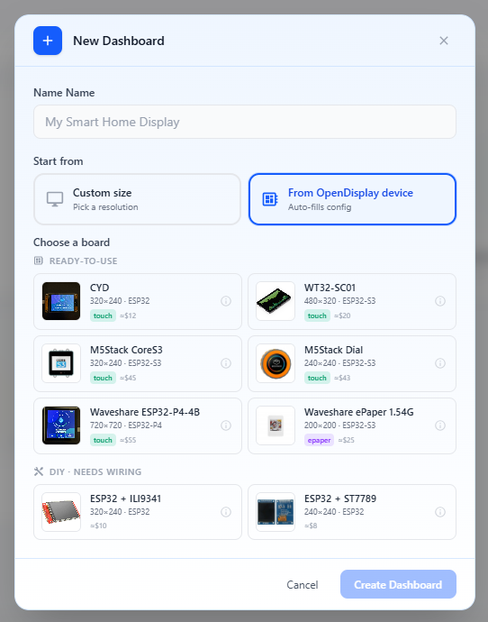
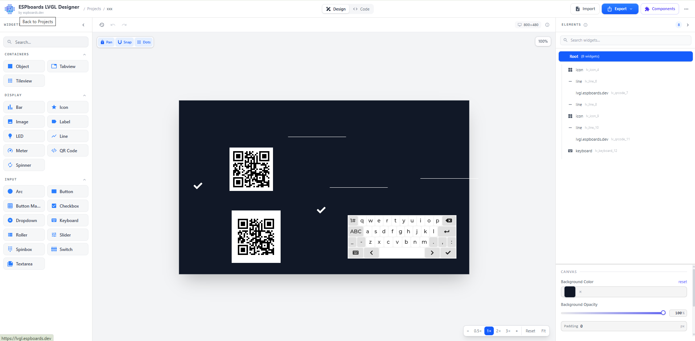
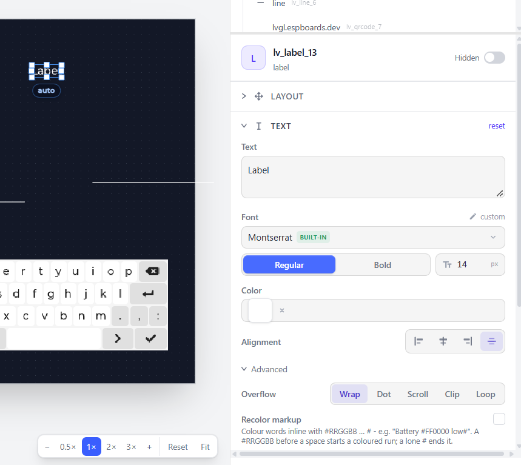
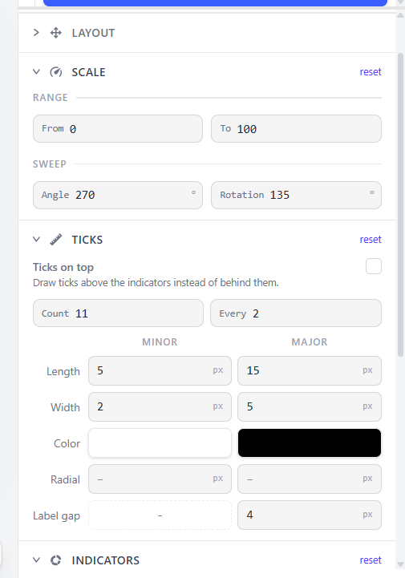

# OpenDisplay Studio UI Design Specs

Status: approved direction candidate  
Scope: information architecture and UI/UX direction only  
References: September 27, 2026 mockups in [`references/`](./references/)

This document is the source of truth for the next UI implementation pass. The
reference screens define intent and density; they are not layouts to copy
pixel-for-pixel. Home Assistant conventions and tokens take precedence where a
reference conflicts with the host application.

## 1. Product vocabulary

- **Dashboard** is the user-facing saved design. It has a stable identity, a
  name, display configuration, elements, status, and generated output.
- **Dashboards** is the navigation label for the dashboard collection. In the
  editor, `Dashboards / <dashboard name>` is the breadcrumb back to that
  collection.
- **Display configuration** is the dashboard's resolution and color palette.
- **OpenDisplay device** is an existing device supplied by the Home Assistant
  OpenDisplay integration. It may prefill display configuration; selecting it
  does not implicitly assign or deploy the dashboard to that physical device.
- One **Dashboard** contains one renderable canvas and one output. There is no
  separate Screen entity or nested list of screens inside a dashboard.

## 2. Visual direction

The application uses a light, Home Assistant-native shell with compact editor
controls and a visually dominant canvas. The interface should feel precise and
tool-like without becoming visually dense or dark. The dashboard surface may
itself be dark or use an e-paper palette; that does not change the surrounding
application theme.

Use Home Assistant components, icons, focus behavior, typography, and tokens
wherever possible, including:

- `--primary-background-color`, `--secondary-background-color`, and
  `--card-background-color` for surfaces;
- `--primary-text-color` and `--secondary-text-color` for hierarchy;
- `--divider-color` for separators and panel boundaries;
- `--primary-color` for selected, active, and primary-action states;
- `--error-color`, `--warning-color`, and success theme tokens for status;
- `--ha-space-*` spacing tokens and logical CSS properties;
- `--header-height` plus `--safe-area-inset-top` for the editor header.

Hard-coded colors are reserved for the actual display palette preview. Controls
must retain visible keyboard focus, adequate contrast, accessible names, and
tooltips for icon-only actions.

## 3. Application model

The interface has three primary states:

1. **Dashboards** — startup dashboard gallery.
2. **New Dashboard** — one modal with two mutually exclusive setup sources.
3. **Editor** — one workspace with `Design` and `Code` views.

There is no separate top-level Preview or Data page in this specification.
Preview is part of the design workspace, and data-source configuration is
contextual to a selected widget.

## 4. Dashboards: collection

This is the first screen shown when OpenDisplay Studio opens.

- Header: `Dashboards`, item count, and the primary `New Dashboard` action.
- Utility row: dashboard search and a compact sort selector, defaulting to
  `Last updated`.
- Content: a responsive card grid with an add card as the first item.
- Dashboard card: saved thumbnail, name, resolution, palette, status
  (`Draft`/`Ready`), and last-updated metadata.
- Selecting a dashboard opens it in the editor. Selecting either add affordance
  opens the same New Dashboard modal.
- Search and empty states must preserve the page structure rather than replace
  it with a different layout.

The cards should communicate the saved design at a glance. Secondary card
menus, bulk actions, folders, and sharing are not introduced by these mockups.

## 5. New Dashboard

The modal keeps the name field and source choice in a stable header section.
Switching source changes only the configuration body. `Create Dashboard` stays
disabled until the visible source has valid required values.

### 5.1 Custom display configuration

- Required dashboard name.
- `Custom size` selected as the setup source.
- Width and height entered directly by the user. Preset resolution cards may be
  offered as shortcuts, but must not replace manual dimensions.
- Palette selected from the palettes supported by OpenDisplay Studio, including
  the six-color Spectra option.
- Existing canvas defaults such as outer padding and snap size belong in the
  collapsed advanced section; their default values remain unchanged unless the
  user edits them.

The reference label `Display Type` is interpreted as palette/color capability,
not as a new hardware taxonomy.

### 5.2 From an OpenDisplay device

- `From OpenDisplay device` selected as the setup source.
- List only devices currently exposed by the Home Assistant OpenDisplay
  integration.
- Each row/card shows the device-friendly name, resolution, and palette/color
  capability available from Home Assistant. Additional device metadata is
  shown only when it helps distinguish otherwise similar devices.
- Selecting a device prefills the dashboard's resolution and palette.
- A clear empty state explains when no compatible OpenDisplay device exists.

The product catalog, prices, `ready-to-use`/`DIY` grouping, and product purchase
imagery in the visual reference are not part of OpenDisplay Studio. They are
replaced by the user's real Home Assistant devices. No hostname, port, or
renderer configuration is requested here.

## 6. Editor workspace

### 6.1 Global header

- Left: OpenDisplay Studio identity followed by
  `Dashboards / <dashboard name>`. `Dashboards` returns to the gallery.
- Center: a two-state `Design` / `Code` view switch.
- Right: the existing dashboard status and save actions only.

The reference application's `Import`, `Export`, and `Components` commands are
not adopted by this specification. The header aligns with the Home Assistant
sidebar/header height and respects the top safe area.

### 6.2 Three-column design layout

The Design view is a full-height, three-column workspace:

1. **Library** on the left.
2. **Canvas and preview** in the center.
3. **Structure and properties** on the right.

Both side panels are collapsible. The right panel remains resizable within a
useful minimum and maximum width. Panels scroll independently, so selecting or
editing an element never moves the canvas viewport.

### 6.3 Library

- Compact search at the top.
- Distinct `Widgets` and `Primitives` sections.
- Catalog entries use a small icon, short name, and optional concise helper
  text; the catalog metadata determines any further grouping.
- Dragging an entry creates the matching element at the pointer position on the
  canvas. The library stays compact enough to preserve canvas width.

### 6.4 Canvas and preview

- Neutral workspace surrounds a fixed-size dashboard surface.
- The dashboard surface uses the selected resolution, palette, background, and
  outer padding.
- Design preview is generated from the same dashboard model used for output.
  Selection handles and editor guides are an interaction overlay and never
  become part of rendered media.
- Existing interaction requirements remain: pan, zoom, fit/reset controls,
  snap-size alignment, stable pointer-relative drag/drop, element movement,
  eight directional resize handles, a live size badge, and `Shift` to preserve
  aspect ratio while resizing.
- Canvas selection and structure-tree selection are bidirectionally linked.
  Selecting, moving, or editing an item must not reset pan, zoom, or scroll.
- Undo and redo cover element creation, movement, resize, property changes,
  visibility, locking, ordering, and deletion.

The saved thumbnail in the Dashboards gallery is a clean preview without editor
chrome. The authoritative Media Source image remains the rendered result, not a
screenshot of selection overlays.

### 6.5 Structure and properties

The right column has two vertically arranged, independently scrollable areas.

**Structure**

- Search and a compact list/tree of every canvas element.
- Selecting a row selects the same element on the canvas.
- Ordering reflects visual stacking order and can be changed by drag-and-drop
  with an explicit insertion marker.
- Existing visibility, lock, and delete actions remain available; destructive
  deletion requires confirmation. Secondary row actions may appear on hover to
  reduce noise.

**Properties**

- With no element selected: dashboard display, background, outer padding, and
  snap settings.
- Selecting an element on the canvas or in Structure opens the same contextual
  inspector directly below Structure. Both selections remain synchronized.
- A compact selected-element summary identifies the element with its type icon,
  name, kind, and visibility state before the property sections.
- Properties are grouped into compact accordions. `Layout` is always first,
  followed only by sections supported by the selected primitive or widget, for
  example `Text`, `Scale`, `Ticks`, `Indicators`, `Appearance`, `Data source`,
  and `Presentation`. Irrelevant empty sections are not rendered.
- Primitive and widget schemas define their fields, grouping, defaults, and
  control types. The inspector shell must not hard-code a separate layout for
  every element type.
- Related values use paired two-column fields when space permits: X/Y,
  width/height, from/to, angle/rotation, or minor/major values. They reflow to
  one column before causing horizontal scrolling.
- Matrix-like settings use short column headings and aligned rows instead of
  repeating long labels. Numeric controls show their unit suffix inside the
  field.
- Each section may expose a right-aligned `Reset` action. It resets only that
  section to its schema defaults, participates in undo/redo, and has a specific
  accessible label such as `Reset Text properties`.
- Color is never presented as a permanently expanded list, radio list, or
  button grid. A fixed dashboard palette uses a compact dropdown containing a
  swatch and color name. Arbitrary color support uses a compact color-picker
  field. The six Spectra colors therefore occupy one closed dropdown row.
- Where applicable, color choices are limited to the active dashboard palette.
  A text name or value accompanies every swatch so color is never the only cue.
- Dropdowns are preferred for enumerations that would consume significant
  vertical space. Segmented controls are reserved for a few short, frequently
  changed modes; booleans use the appropriate Home Assistant switch or
  checkbox pattern.
- Controls use short persistent labels, compact Home Assistant fields, thin
  dividers, and minimal vertical gaps. Density never relies on placeholders and
  does not remove keyboard focus, accessible names, or required target sizes.
- Structure and Properties scroll independently. Selecting an element or
  editing any property must not scroll or reposition the canvas.
- Property changes update the Design preview immediately, mark the dashboard as
  changed, and participate in undo/redo.

The font, overflow, scale, tick, and indicator controls in the references
demonstrate organization and density. They do not add those capabilities to an
element that does not already support them.

## 7. Data management

There is no global data-management screen in the references. Home Assistant
data is configured inside the selected widget's Properties section:

- use Home Assistant selectors for entities, calendars, devices, or other
  sources requested by the widget schema;
- persist source references and widget options, not current values;
- show current values in the design preview when available;
- resolve authoritative values again when rendering output.

This keeps data configuration next to the element that consumes it and avoids
exposing the entire Home Assistant state machine as an editor-wide data model.

## 8. Code view

`Code` is an alternate view of the currently open dashboard, not a separate
dashboard or storage model.

- Show the generated ODL YAML for the saved design and current stacking order.
- Provide a clearly visible `Copy` action.
- Keep generated code read-only at this stage; direct code editing, importing,
  and conflict resolution are not implied by the mockup.
- Returning to `Design` restores the canvas viewport and selection.

## 9. Shared patterns and reference differences

| Area | Shared direction | Required adaptation |
| --- | --- | --- |
| Surfaces | Light, low-contrast shell with one blue primary accent | Use Home Assistant theme tokens instead of fixed reference colors |
| Density | Compact controls, short labels, clear selected state | Preserve accessibility and touch targets where HA components require them |
| Creation | One modal, stable name/source header, persistent actions | Replace product catalog content with configured OpenDisplay devices |
| Navigation | Collection first, then a named editor context | Replace the reference brand with OpenDisplay Studio and `Dashboards / name` |
| Editor | Library, dominant canvas, structure plus properties | Retain only current OpenDisplay Studio actions and supported primitives/widgets |
| Preview | Immediate visual representation of the design | Keep editor overlays separate from generated Media Source output |
| Code | Design/Code switch for the same dashboard | Read-only generated ODL with Copy; no new import workflow |

The first reference is a full-page collection, the second and third are two
states of the same creation modal, and the fourth is the editing workspace.
They should not be merged into one overloaded screen.

## 10. Responsive and state behavior

- The Dashboards card grid reduces columns as space narrows.
- The creation modal keeps its actions visible while its body scrolls.
- The editor is desktop-first. At constrained widths, collapse side panels
  before shrinking the dashboard surface or inspector fields into unusable
  widths.
- Define consistent loading, empty, validation, disabled, and error states using
  Home Assistant patterns. Avoid layout shifts when those states change.

## 11. Scope guardrails

This direction does not add a marketplace, product catalog, dashboard sharing,
multiple screens per dashboard, direct deployment to a physical device,
editable code, a global data manager, a separate Preview page, or the reference
editor's Import/Export/Components features. Any of these requires a separate
product decision and an update to this specification.
