# Widgets

A widget shows live Home Assistant data inside a dashboard. You pick *what* to show
(its **sources**), set *how* it looks (its **options**) and resize its frame; the
widget lays itself out to fit. Every widget has the same **Appearance** options:

* **Show frame** — draw the frame and white background (on by default). Turn it off to
  place the content straight onto the dashboard.
* **Invert colors** — draw white on black instead of black on white.

This page is generated by `python -m scripts.widget_docs`. To write your own widget see
[the widget SDK](../widget-sdk.md).

## Agenda

Upcoming events from one or more calendars on one list.

Default size 360 x 240 px, smallest 180 x 90 px. Id: `agenda`.

### Sources

| Source | What to pick | Per pick |
|---|---|---|
| Calendars | one or more calendar entity | Label, Color, Icon |

### Options

**Content**

| Option | Key | Values | Default |
|---|---|---|---|
| Number of events | `maxEvents` | number 1 to 20 | `5` |
| Look ahead (days) | `days` | number 1 to 60 | `14` |
| Text when there are no events | `emptyText` | text | empty |

**Presentation**

| Option | Key | Values | Default |
|---|---|---|---|
| Group by day | `groupByDay` | on / off | on |
| Show time | `showTime` | on / off | on |
| Show location | `showLocation` | on / off | off |
| Show calendar icons | `showIcons` | on / off | off |
| Show calendar label | `showCalendarLabel` | on / off | on |
| 24 h clock | `use24h` | on / off | on |

**Appearance**

| Option | Key | Values | Default |
|---|---|---|---|
| Show frame | `showFrame` | on / off | on |
| Invert colors | `invert` | on / off | off |

### Examples

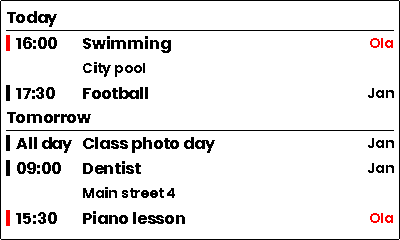
*Two calendars merged*

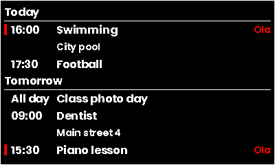
*Inverted colors*

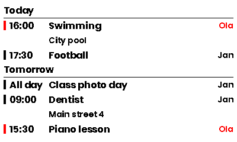
*Without frame and background*

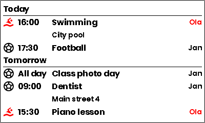
*Calendar icons with the place below*

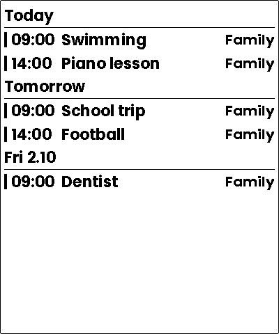
*A busy week*

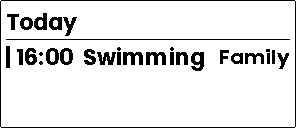
*A single event*

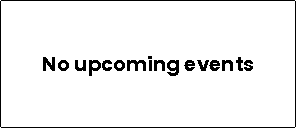
*Nothing planned*

## Sensor card

The value of one or more entities, as a big tile, a list or a grid.

Default size 280 x 160 px, smallest 120 x 80 px. Id: `sensor-card`.

### Sources

| Source | What to pick | Per pick |
|---|---|---|
| Entities | one or more entity | Label, Icon |

### Options

**Layout**

| Option | Key | Values | Default |
|---|---|---|---|
| Layout | `layout` | one of `single`, `list`, `grid` | `single` |

**Content**

| Option | Key | Values | Default |
|---|---|---|---|
| Show icon | `showIcon` | on / off | on |
| Show name | `showName` | on / off | on |
| Show unit | `showUnit` | on / off | on |
| Decimals | `decimals` | one of `auto`, `0`, `1`, `2`, `3` | `auto` |
| Value size | `valueSize` | one of `auto`, `small`, `medium`, `large` | `auto` |

**Thresholds**

| Option | Key | Values | Default |
|---|---|---|---|
| Alert below | `alertBelow` | text | empty |
| Alert above | `alertAbove` | text | empty |
| Alert color | `alertColor` | color | `accent` |

**Appearance**

| Option | Key | Values | Default |
|---|---|---|---|
| Show frame | `showFrame` | on / off | on |
| Invert colors | `invert` | on / off | off |

### Examples

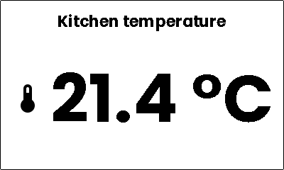
*One entity as a tile*

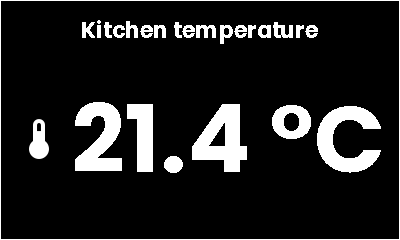
*Inverted colors*

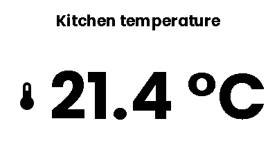
*Without frame and background*

*Several entities as a list*

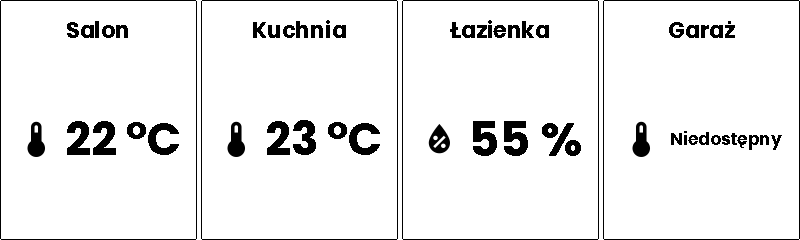
*Several entities as a grid*

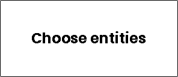
*Nothing chosen yet*

## Weather

Current conditions and a daily or hourly forecast of a weather entity.

Default size 360 x 200 px, smallest 160 x 100 px. Id: `weather`.

### Sources

| Source | What to pick | Per pick |
|---|---|---|
| Weather entity | one weather entity | — |

### Options

**Forecast**

| Option | Key | Values | Default |
|---|---|---|---|
| Forecast | `forecastType` | one of `daily`, `hourly` | `daily` |
| Number of forecast items | `forecastItems` | number 1 to 8 | `5` |

**Details**

| Option | Key | Values | Default |
|---|---|---|---|
| Show humidity | `showHumidity` | on / off | on |
| Show feels like | `showFeelsLike` | on / off | off |
| Show wind | `showWind` | on / off | off |

**Appearance**

| Option | Key | Values | Default |
|---|---|---|---|
| Show frame | `showFrame` | on / off | on |
| Invert colors | `invert` | on / off | off |

### Examples

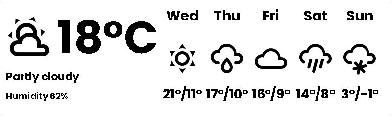
*Daily forecast*

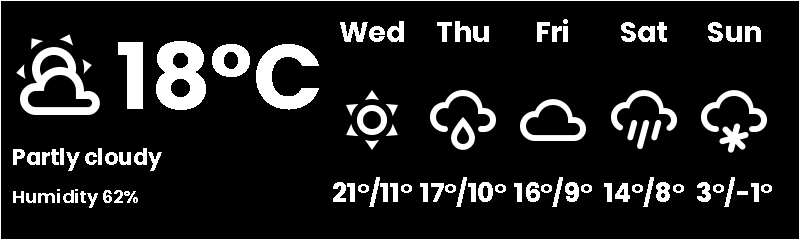
*Inverted colors*

*Without frame and background*

*Hourly forecast with details*

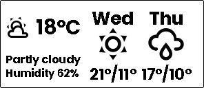
*Small frame*

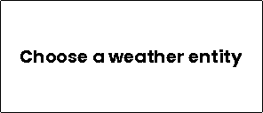
*Nothing chosen yet*
