# Widgets

A widget shows live Home Assistant data inside a dashboard. You pick *what* to show
(its **sources**), set *how* it looks (its **options**) and resize its frame; the
widget lays itself out to fit. Every widget has the same **Appearance** options:

* **Show frame** — draw the frame and white background (on by default). Turn it off to
  place the content straight onto the dashboard.
* **Corner radius** — how round the corners of the frame are.
* **Color** and **Background** — the color of everything drawn (text, icons,
  lines, the frame) and of what is filled behind it. They are picked from the
  colors of the display, so white on black is just two colors; on a display
  with red and yellow you can have yellow on red.

This page is generated by `python -m scripts.widget_docs`. To write your own widget see
[the widget SDK](../widget-sdk.md).

## Agenda

Upcoming events from one or more calendars on one list.

Default size 360 x 240 px, smallest 180 x 90 px. Id: `agenda`.

### Sources

| Source | What to pick | Per pick |
|---|---|---|
| Calendars | one or more calendar entity | Label, Color, Icon |

### Options

**Content**

| Option | Key | Values | Default |
|---|---|---|---|
| Number of events | `maxEvents` | number 1 to 20 | `5` |
| Look ahead (days) | `days` | number 1 to 60 | `14` |
| Text when there are no events | `emptyText` | text | empty |

**Presentation**

| Option | Key | Values | Default |
|---|---|---|---|
| Group by day | `groupByDay` | on / off | on |
| Show time | `showTime` | on / off | on |
| Show location | `showLocation` | on / off | off |
| Show calendar icons | `showIcons` | on / off | off |
| Show calendar label | `showCalendarLabel` | on / off | on |
| 24 h clock | `use24h` | on / off | on |

**Appearance**

| Option | Key | Values | Default |
|---|---|---|---|
| Show frame | `showFrame` | on / off | on |
| Corner radius | `cornerRadius` | number 0 to 24 | `6` |
| Color | `color` | color | `black` |
| Background | `background` | color | `white` |

### Examples

*Two calendars merged*

*White on black*

*Yellow on red on a BWRY display*

*Without frame and background*

*Calendar icons with the place below*

*A busy week*

*A single event*

*Nothing planned*

## School timetable

A school week of one calendar as a table of days and lesson slots.

Default size 800 x 480 px, smallest 360 x 200 px. Id: `school-timetable`.

### Sources

| Source | What to pick | Per pick |
|---|---|---|
| Calendar | one calendar entity | — |

### Options

**Week**

| Option | Key | Values | Default |
|---|---|---|---|
| Days | `days` | one of `5`, `7` | `5` |
| On a weekend show | `weekend` | one of `current`, `next` | `current` |
| Day names | `dayNames` | one of `auto`, `short`, `full` | `auto` |
| 24 h clock | `use24h` | on / off | on |

**Titles**

| Option | Key | Values | Default |
|---|---|---|---|
| Short names (one "Full name = Short" per line) | `aliases` | text | empty |
| Text to remove from titles (one per line) | `stripText` | text | `[ZASTĘPSTWO]` |

**Appearance**

| Option | Key | Values | Default |
|---|---|---|---|
| Lesson in progress | `highlightColor` | color | `accent` |
| Show grid lines | `showGrid` | on / off | on |
| Show footer | `showFooter` | on / off | on |
| Show frame | `showFrame` | on / off | on |
| Corner radius | `cornerRadius` | number 0 to 24 | `6` |
| Color | `color` | color | `black` |
| Background | `background` | color | `white` |

### Examples

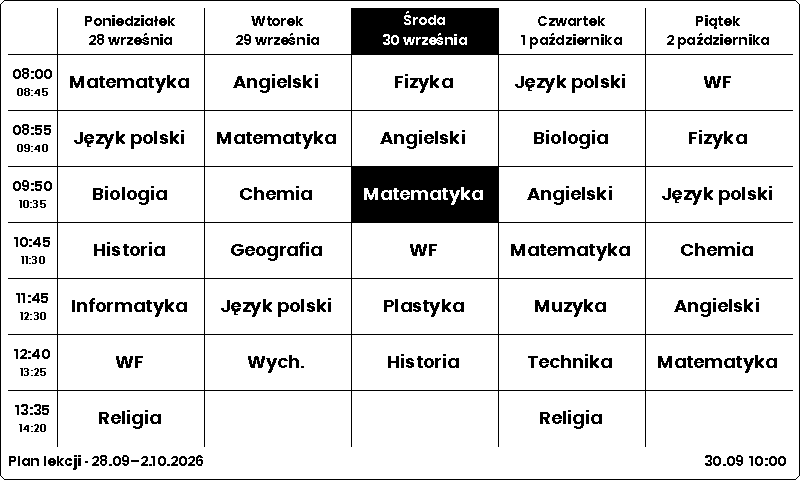
*A school week, the lesson in progress highlighted*

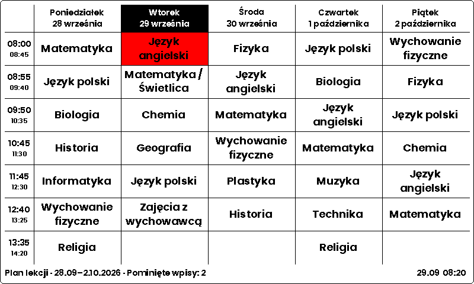
*Short names and removed substitution markers*

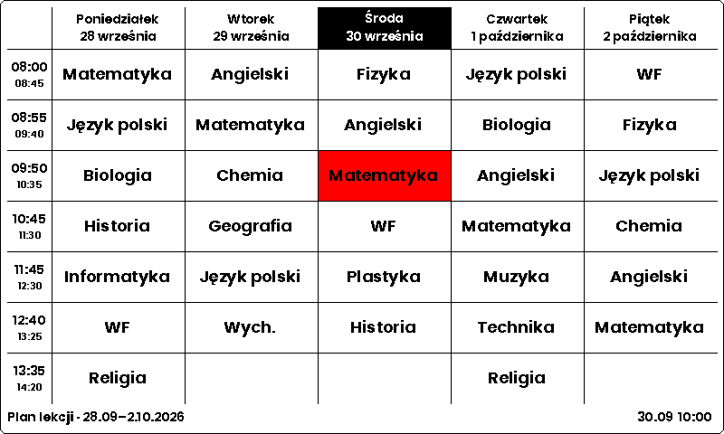
*On a BWRY display the lesson in progress is red*

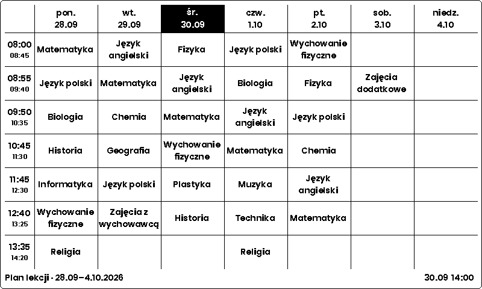
*Seven days*

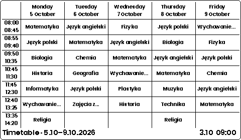
*On a weekend the next week can be shown*

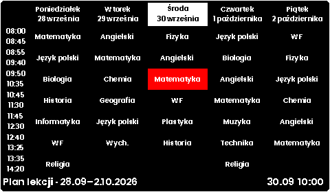
*White on black without grid lines*

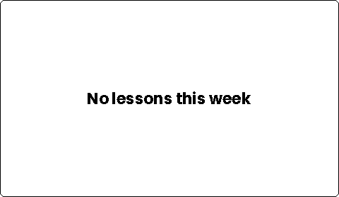
*No lessons*

## Sensor card

The value of one entity as a tile that follows the shape of its frame.

Default size 280 x 160 px, smallest 120 x 80 px. Id: `sensor-card`.

### Sources

| Source | What to pick | Per pick |
|---|---|---|
| Entity | one entity | Label, Icon |

### Options

**Content**

| Option | Key | Values | Default |
|---|---|---|---|
| Show icon | `showIcon` | on / off | on |
| Show name | `showName` | on / off | on |
| Show unit | `showUnit` | on / off | on |
| Decimals | `decimals` | one of `auto`, `0`, `1`, `2`, `3` | `auto` |
| Show separator | `showSeparator` | on / off | on |
| Alignment | `align` | one of `auto`, `left`, `center`, `right` | `auto` |
| Value size | `valueSize` | one of `auto`, `small`, `medium`, `large` | `auto` |

**Thresholds**

| Option | Key | Values | Default |
|---|---|---|---|
| Alert below | `alertBelow` | text | empty |
| Alert above | `alertAbove` | text | empty |
| Alert color | `alertColor` | color | `accent` |

**Appearance**

| Option | Key | Values | Default |
|---|---|---|---|
| Show frame | `showFrame` | on / off | on |
| Corner radius | `cornerRadius` | number 0 to 24 | `6` |
| Color | `color` | color | `black` |
| Background | `background` | color | `white` |

### Examples

*A wide tile puts the icon on the left and the unit beside the value*

*A square tile stacks icon, name, value and unit*

*A tall tile is separated by a line*

*White on black*

*Red with yellow elements on a BWRY display*

*Without frame and background*

*Nothing chosen yet*

## Sensor chart

The value of one entity with its history as a line chart.

Default size 385 x 225 px, smallest 200 x 120 px. Id: `sensor-chart`.

### Sources

| Source | What to pick | Per pick |
|---|---|---|
| Entity | one entity | Label, Icon |

### Options

**Content**

| Option | Key | Values | Default |
|---|---|---|---|
| Show icon | `showIcon` | on / off | on |
| Show name | `showName` | on / off | on |
| Show unit | `showUnit` | on / off | on |
| Decimals | `decimals` | one of `auto`, `0`, `1`, `2`, `3` | `auto` |

**Chart**

| Option | Key | Values | Default |
|---|---|---|---|
| Hours to show | `hours` | number 1 to 168 | `24` |
| Smoothing | `smoothing` | on / off | on |
| Chart placement | `placement` | one of `auto`, `bottom`, `right` | `auto` |
| Show min and max | `showMinMax` | on / off | on |

**Details**

| Option | Key | Values | Default |
|---|---|---|---|
| Show type chip | `showChip` | on / off | on |
| Show entity id | `showEntityId` | on / off | on |
| Show time of the last update | `showUpdated` | on / off | on |

**Appearance**

| Option | Key | Values | Default |
|---|---|---|---|
| Show frame | `showFrame` | on / off | on |
| Corner radius | `cornerRadius` | number 0 to 24 | `6` |
| Color | `color` | color | `black` |
| Background | `background` | color | `white` |

### Examples

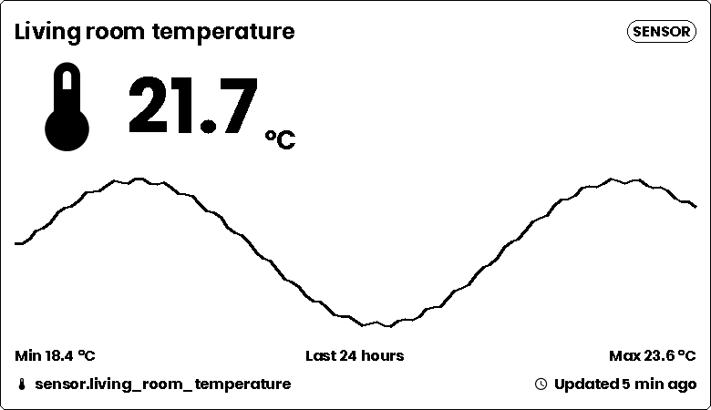
*Full size: the chart below the value*

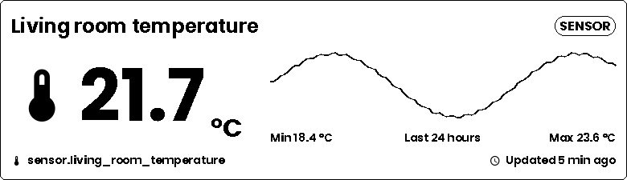
*Half horizontal: the chart beside the value*

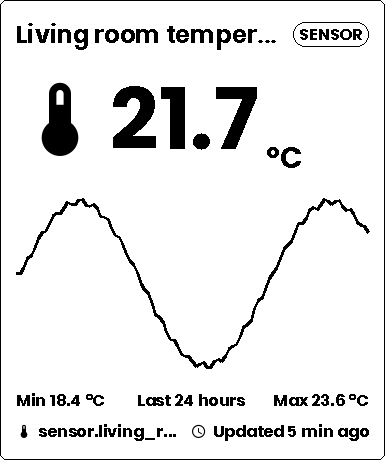
*Half vertical*

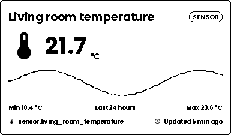
*Quadrant*

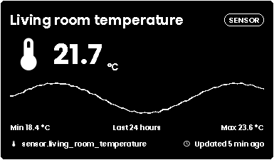
*White on black*

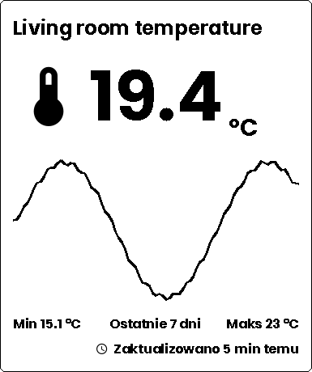
*A week, without the details*

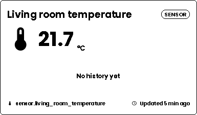
*An entity without history*

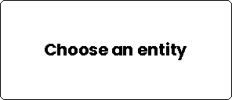
*Nothing chosen yet*

## Sensor list

The values of several entities, one line each.

Default size 280 x 200 px, smallest 160 x 80 px. Id: `sensor-list`.

### Sources

| Source | What to pick | Per pick |
|---|---|---|
| Entities | one or more entity | Label, Icon |

### Options

**Content**

| Option | Key | Values | Default |
|---|---|---|---|
| Show icon | `showIcon` | on / off | on |
| Show name | `showName` | on / off | on |
| Show unit | `showUnit` | on / off | on |
| Decimals | `decimals` | one of `auto`, `0`, `1`, `2`, `3` | `auto` |
| Show dividers | `showDividers` | on / off | on |

**Thresholds**

| Option | Key | Values | Default |
|---|---|---|---|
| Alert below | `alertBelow` | text | empty |
| Alert above | `alertAbove` | text | empty |
| Alert color | `alertColor` | color | `accent` |

**Appearance**

| Option | Key | Values | Default |
|---|---|---|---|
| Show frame | `showFrame` | on / off | on |
| Corner radius | `cornerRadius` | number 0 to 24 | `6` |
| Color | `color` | color | `black` |
| Background | `background` | color | `white` |

### Examples

*A list where one value is past its threshold*

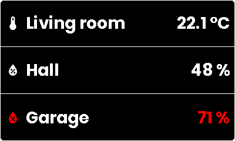
*White on black*

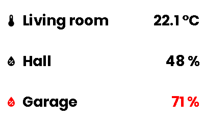
*Without frame and dividers*

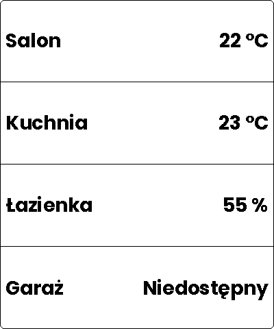
*Names only in Polish*

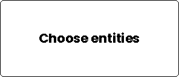
*Nothing chosen yet*

## Weather

Current conditions and a daily or hourly forecast of a weather entity.

Default size 360 x 200 px, smallest 160 x 100 px. Id: `weather`.

### Sources

| Source | What to pick | Per pick |
|---|---|---|
| Weather entity | one weather entity | — |

### Options

**Forecast**

| Option | Key | Values | Default |
|---|---|---|---|
| Forecast | `forecastType` | one of `daily`, `hourly` | `daily` |
| Number of forecast items | `forecastItems` | number 1 to 8 | `5` |

**Details**

| Option | Key | Values | Default |
|---|---|---|---|
| Show humidity | `showHumidity` | on / off | on |
| Show feels like | `showFeelsLike` | on / off | off |
| Show wind | `showWind` | on / off | off |

**Appearance**

| Option | Key | Values | Default |
|---|---|---|---|
| Show frame | `showFrame` | on / off | on |
| Corner radius | `cornerRadius` | number 0 to 24 | `6` |
| Color | `color` | color | `black` |
| Background | `background` | color | `white` |

### Examples

*Daily forecast*

*White on black*

*Square corners*

*Without frame and background*

*Hourly forecast with details*

*Small frame*

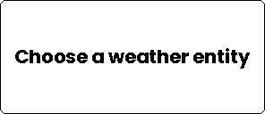
*Nothing chosen yet*
