# Widgets

A widget shows live Home Assistant data inside a dashboard. You pick *what* to show
(its **sources**), set *how* it looks (its **options**) and resize its frame; the
widget lays itself out to fit.

This page is generated by `python -m scripts.widget_docs`, so it always says what the
widgets do. To write your own widget see [the widget SDK](../widget-sdk.md).

## Options every widget has

| Option | Key | What it does |
|---|---|---|
| Show frame | `showFrame` | Draws the frame and the background. Turn it off to place the content straight onto the dashboard. |
| Corner radius | `cornerRadius` | How round the corners of the frame are. |
| Color | `color` | The color of everything drawn: text, icons, lines and the frame. |
| Background | `background` | What is filled behind it. |
| Font | `font` | Any font that comes with OpenDisplay Studio or that you installed in Settings. |

Colors are picked from the colors of the display, so white on black is two colors, and on
a display with red and yellow you can have yellow on red. A few widgets also have a
**Text size**: leave it on Auto to fit the frame, or type the size you want.

## The widgets

| | Widget | Shows |
|---|---|---|
|  | [**Agenda**](#agenda) | Upcoming events from one or more calendars on one list. |
|  | [**Battery**](#battery) | The charge of a battery as a battery that fills up, with its percentage. |
|  | [**Calendar**](#calendar) | Events of one or more calendars as upcoming days, an agenda or a grid of weeks. |
|  | [**Gauge**](#gauge) | The value of a sensor on a half dial, with a marker or a filled arc. |
|  | [**School timetable**](#school-timetable) | A school week of one calendar as a table of days and lesson slots. |
|  | [**Sensor card**](#sensor-card) | The value of one entity as a tile that follows the shape of its frame. |
|  | [**Sensor chart**](#sensor-chart) | The value of one entity with its history as a line chart. |
|  | [**Sensor list**](#sensor-list) | The values of several entities, one line each. |
|  | [**Thermometer**](#thermometer) | A temperature on a classic round dial with a needle. |
|  | [**Waste collection**](#waste-collection) | When each bin is collected, from up to four calendars, with the nearest dates highlighted. |
|  | [**Weather**](#weather) | Current conditions and a daily or hourly forecast of a weather entity. |

---

## Agenda

*Upcoming events from one or more calendars on one list.*

| Default size | Smallest | Id |
|---|---|---|
| 360 × 240 px | 180 × 90 px | `agenda` |

 In the colors of a Spectra 6 display

### Sources

| Source | What to pick | Per pick |
|---|---|---|
| Calendars | one or more calendar entity | Label, Color, Icon |

### Options

**Content**

| Option | Key | Values | Default |
|---|---|---|---|
| Number of events | `maxEvents` | number 1 to 20 | `5` |
| Look ahead (days) | `days` | number 1 to 60 | `14` |
| Text when there are no events | `emptyText` | text | empty |

**Presentation**

| Option | Key | Values | Default |
|---|---|---|---|
| Group by day | `groupByDay` | on / off | on |
| Show time | `showTime` | on / off | on |
| Show location | `showLocation` | on / off | off |
| Show calendar icons | `showIcons` | on / off | off |
| Show calendar label | `showCalendarLabel` | on / off | on |
| 24 h clock | `use24h` | on / off | on |

**Appearance**

| Option | Key | Values | Default |
|---|---|---|---|
| Text size | `textSize` | number 10 to 128 | automatic |

### Examples

<table>
<tr><td align="center" valign="top"> Two calendars merged</td><td align="center" valign="top"> White on black</td></tr>
<tr><td align="center" valign="top"> Yellow on red on a BWRY display</td><td align="center" valign="top"> Without frame and background</td></tr>
<tr><td align="center" valign="top"> Calendar icons with the place below</td><td align="center" valign="top"> A busy week</td></tr>
<tr><td align="center" valign="top"> A single event</td><td align="center" valign="top"> Nothing planned</td></tr>
<tr><td align="center" valign="top">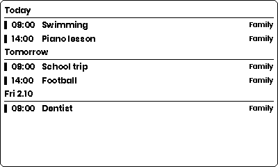 A smaller text size fits more events</td><td align="center" valign="top">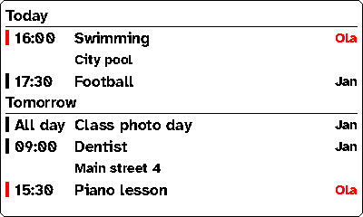 In Atkinson Hyperlegible, made to be easy to read</td></tr>
<tr><td align="center" valign="top">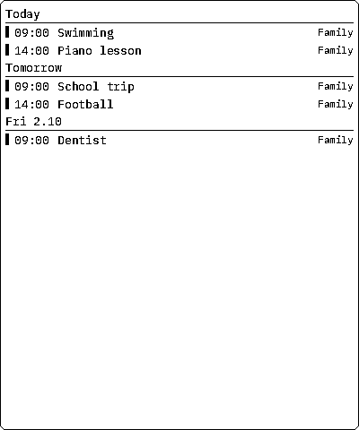 In IBM Plex Mono, so the times line up</td><td align="center" valign="top">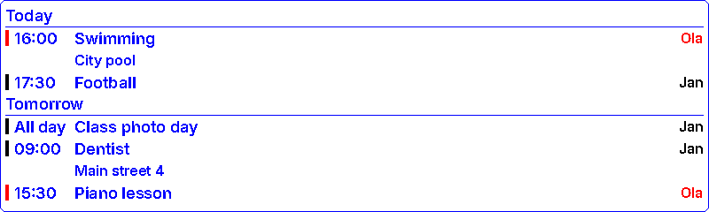 In Inter on half of a display</td></tr>
</table>

---

## Battery

*The charge of a battery as a battery that fills up, with its percentage.*

| Default size | Smallest | Id |
|---|---|---|
| 200 × 100 px | 24 × 24 px | `battery` |

 A charged battery in the colors of a Spectra 6 display

Shows one battery entity as a battery that fills up in proportion to its charge, with
the percentage beside it (or under it in a tall frame). Pick a battery sensor (a
percentage) or a binary sensor that says whether its battery is low; the second is drawn
nearly empty and marked "Low", or full and marked "OK".

At or below **Low battery at or below** the battery and its text are drawn in the
highlight color of the display. The battery lies down in a wide frame and stands up in a
tall one, or as you choose with **Orientation**. The size of the text comes from the
frame and not from the number, so batteries of one size are laid out alike.

With **Percentage: inside the battery** the number is drawn in the middle of the
battery, which takes less room. It is outlined in the color of the background, whatever
the charge, so it reads on the fill and off it and looks the same at every level.

Turn off the name and the percentage (or put the percentage inside) and the battery fills the
whole widget: make the widget small and put it in a corner of the display to show the
charge of the e-paper display itself. **Style: segments** draws the charge as up to ten
rounded segments of one size, fewer when the battery is short; the segments that are full
follow the charge, rounded to the nearest, and at least one while there is any charge.

### Sources

| Source | What to pick | Per pick |
|---|---|---|
| Entity | one sensor or binary_sensor entity | Label |

### Options

**Content**

| Option | Key | Values | Default |
|---|---|---|---|
| Show name | `showName` | on / off | on |
| Show percentage | `showPercentage` | on / off | on |
| Style | `style` | one of `solid`, `segments` | `solid` |
| Percentage | `percentagePlacement` | one of `beside`, `inside` | `beside` |
| Orientation | `orientation` | one of `auto`, `horizontal`, `vertical` | `auto` |

**Thresholds**

| Option | Key | Values | Default |
|---|---|---|---|
| Low battery at or below | `lowLevel` | number 0 to 100 | `20` |
| Low battery color | `alertColor` | color | `accent` |

### Examples

<table>
<tr><td align="center" valign="top"> A charged battery in a wide frame</td><td align="center" valign="top"> A low battery is drawn in the highlight color</td></tr>
<tr><td align="center" valign="top"> A tall frame stands the battery up</td><td align="center" valign="top"> Half full, in Polish, on a small tag</td></tr>
<tr><td align="center" valign="top"> The percentage inside the battery, readable on the fill and off it</td><td align="center" valign="top"> Standing, with the percentage inside</td></tr>
<tr><td align="center" valign="top"> Rounded segments: ten on a long battery</td><td align="center" valign="top"> Fewer segments on a short one, standing</td></tr>
<tr><td align="center" valign="top"> Segments with the percentage inside</td><td align="center" valign="top"> Only the battery, for the corner of a display: it fills the whole widget</td></tr>
<tr><td align="center" valign="top"> The same in solid, with the percentage inside</td><td align="center" valign="top"> A sensor that only says low or fine</td></tr>
<tr><td align="center" valign="top"> White on black, without the name</td><td align="center" valign="top">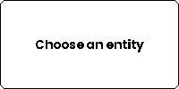 Nothing chosen yet</td></tr>
<tr><td align="center" valign="top"> A low battery in red on a Spectra 6 display</td><td align="center" valign="top">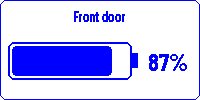 In Barlow Condensed</td></tr>
<tr><td align="center" valign="top">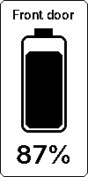 Standing, in Inter</td><td align="center" valign="top">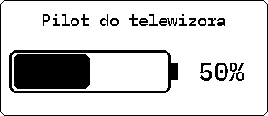 A half full battery in IBM Plex Mono</td></tr>
</table>

---

## Calendar

*Events of one or more calendars as upcoming days, an agenda or a grid of weeks.*

| Default size | Smallest | Id |
|---|---|---|
| 800 × 480 px | 240 × 140 px | `calendar` |

 Upcoming events in the colors of a Spectra 6 display

One widget with three views of the same calendars, chosen with **View**. Pick one or
more calendars; give each a label, a color and an icon of its own. Events of several
calendars are merged, identical ones are shown once, and the color of the calendar
marks its events.

* **Upcoming events** lists the next days (3 by default) in as many columns as fit the
  frame, each day under a heading that is filled for today. Events are numbered, all-day
  events carry a hash, and times, descriptions and places can be turned on or off.
  A bar at the bottom names the view and the calendars. What does not fit is counted
  as `+N more`.
* **Agenda** gives every day with events a bar and every event a line: when it starts,
  its title and description, when it ends. It shows as many days as the frame holds.
* **Weeks** is a grid of up to six weeks, starting from this week or from the first of
  the month, on the weekday you choose. All-day and multi-day events are bars over
  their days (across rows too), events of a day are listed in its cell, weekends are
  dotted and today is marked. Week numbers and the month can be added.

Events that have ended are hidden in the two lists (turn that off with *Hide events
that have ended*), and events can be left out by a word they contain or by their exact
name. An event without a title is shown as "Busy".

Home Assistant gives a calendar no guests and no color per event, so there is no filter
for declined invitations, and the color is that of the calendar.

### Sources

| Source | What to pick | Per pick |
|---|---|---|
| Calendars | one or more calendar entity | Label, Color, Icon |

### Options

**View**

| Option | Key | Values | Default |
|---|---|---|---|
| View | `view` | one of `upcoming`, `agenda`, `weeks` | `upcoming` |

**Content**

| Option | Key | Values | Default |
|---|---|---|---|
| Show times | `includeTime` | on / off | on |
| 24 h clock | `use24h` | on / off | on |
| Show descriptions | `includeDescription` | on / off | on |
| Show places | `showLocation` | on / off | off |
| Date format | `dateFormat` | one of `short`, `full`, `numeric` | `short` |
| Hide events that have ended | `hidePast` | on / off | on |
| Highlight today | `highlightToday` | on / off | on |

**Upcoming and agenda**

| Option | Key | Values | Default |
|---|---|---|---|
| Days to show (upcoming) | `days` | number 1 to 7 | `3` |
| Today only (upcoming) | `todayOnly` | on / off | off |
| Days to look ahead | `lookahead` | number 1 to 60 | `14` |
| Columns (upcoming) | `columns` | one of `auto`, `1`, `2`, `3` | `auto` |
| Number the events (upcoming) | `showIndex` | on / off | on |
| Show the title bar (upcoming) | `showTitleBar` | on / off | on |
| Title bar text (empty for the default) | `titleBarText` | text | empty |
| Vertical alignment (upcoming) | `alignment` | one of `top`, `center`, `bottom` | `top` |
| Larger text | `zoom` | on / off | off |
| Text size | `textSize` | number 10 to 128 | automatic |

**Weeks**

| Option | Key | Values | Default |
|---|---|---|---|
| Weeks to show | `weeks` | one of `auto`, `1`, `2`, `3`, `4`, `5`, `6` | `auto` |
| Weeks start from | `monthMode` | one of `rolling`, `month` | `rolling` |
| First day of the week | `firstDay` | one of `monday`, `tuesday`, `wednesday`, `thursday`, `friday`, `saturday`, `sunday` | `monday` |
| Show week numbers | `weekNumbers` | on / off | off |
| Show the month | `monthHeader` | on / off | off |
| Shade weekends | `shadeWeekends` | on / off | on |

**Filters**

| Option | Key | Values | Default |
|---|---|---|---|
| Hide events containing (one per line) | `ignore` | text | empty |
| Hide events named exactly (one per line) | `ignoreExact` | text | empty |

### Examples

<table>
<tr><td align="center" valign="top"> Upcoming events: the next days in columns, with a bar naming the calendars</td><td align="center" valign="top"> Upcoming events on half of a display</td></tr>
<tr><td align="center" valign="top"> Upcoming events in a narrow frame, with a counter for what does not fit</td><td align="center" valign="top"> Upcoming events in a quadrant</td></tr>
<tr><td align="center" valign="top"> Agenda: a bar for each day and a line for each event</td><td align="center" valign="top"> Agenda in a narrow frame</td></tr>
<tr><td align="center" valign="top"> Weeks: a grid with bars over days, shaded weekends and today marked</td><td align="center" valign="top"> Weeks with the month and the number of each week</td></tr>
<tr><td align="center" valign="top"> Weeks in a narrow frame</td><td align="center" valign="top"> Three calendars with their colors on a BWRY display</td></tr>
<tr><td align="center" valign="top"> The agenda with colored calendars</td><td align="center" valign="top"> Dates and words in the language of the dashboard</td></tr>
<tr><td align="center" valign="top"> White on black</td><td align="center" valign="top">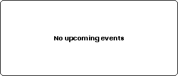 Nothing planned</td></tr>
<tr><td align="center" valign="top">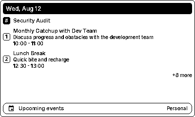 Upcoming events in Inter</td><td align="center" valign="top">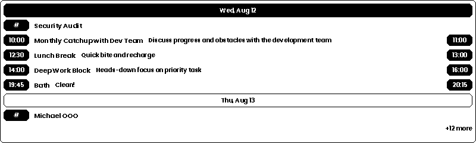 A smaller text size fits more of the agenda</td></tr>
<tr><td align="center" valign="top">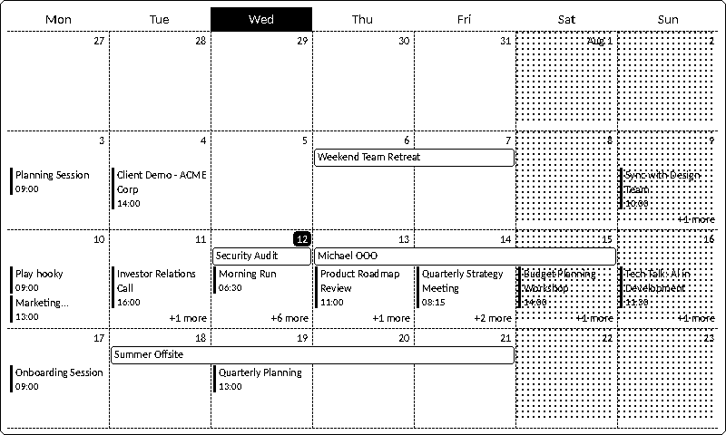 Weeks in Carlito, the look of Calibri</td><td align="center" valign="top">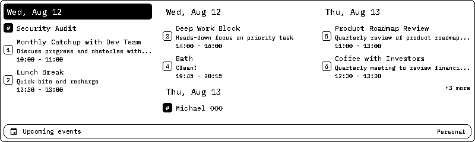 Upcoming events in IBM Plex Mono</td></tr>
</table>

---

## Gauge

*The value of a sensor on a half dial, with a marker or a filled arc.*

| Default size | Smallest | Id |
|---|---|---|
| 240 × 160 px | 96 × 64 px | `gauge` |

 Ranges: green, yellow from 40 and red from 80, as for the load of a processor

Shows the value of one numeric sensor on a half dial. A marker across the arc points
at the value (or, with **Style: arc**, the arc is filled up to it), and the value is
written in the middle, with its unit.

**Scale** sets the lowest and the highest value the dial shows. A value beyond either end
is drawn at that end.

**Ranges** color the arc, as many as you want. Add one for each color and say where it
starts; it lasts until the next one starts. The first one has no start to give: it begins
at the lowest value. Green, then yellow from 40 and red from 80 is the usual load of a
processor; on a scale from 0 to 1 the same ranges start at 0.4 and 0.8. Leave out the
first range and the arc has no color before the second one starts. The colors are those
of your display. A filled arc takes the color of each range it passes.

The ticks are one for every tenth of the scale, and under the ends of the arc are the
lowest and the highest value. In a small frame the ticks and then the limits and the name
are left out, so the dial itself is as big as it can be.

### Sources

| Source | What to pick | Per pick |
|---|---|---|
| Entity | one sensor or input_number or number entity | Label |

### Options

**Content**

| Option | Key | Values | Default |
|---|---|---|---|
| Show name | `showName` | on / off | on |
| Show value | `showValue` | on / off | on |
| Show unit | `showUnit` | on / off | on |
| Decimals | `decimals` | one of `auto`, `0`, `1`, `2`, `3` | `1` |
| Style | `style` | one of `needle`, `arc` | `needle` |
| Show ticks | `showTicks` | on / off | on |
| Show minimum and maximum | `showLimits` | on / off | on |

**Scale**

| Option | Key | Values | Default |
|---|---|---|---|
| Minimum | `min` | number | `0` |
| Maximum | `max` | number | `100` |

**Ranges**

| Option | Key | Values | Default |
|---|---|---|---|
| Ranges | `ranges` | list of colored ranges | `[]` |

### Examples

<table>
<tr><td align="center" valign="top"> A marker across the arc shows the value</td><td align="center" valign="top"> The marker in the red range</td></tr>
<tr><td align="center" valign="top"> A scale from 0 to 1 with the ranges from 0.4 and 0.8</td><td align="center" valign="top"> A scale that runs below zero, red below it and green from zero</td></tr>
<tr><td align="center" valign="top"> The arc filled up to the value, in the color of each range it passes</td><td align="center" valign="top"> Filled into the red range</td></tr>
<tr><td align="center" valign="top"> A value beyond the scale stays at its end</td><td align="center" valign="top"> Without ticks and limits</td></tr>
<tr><td align="center" valign="top"> In a small frame the extras give way to the dial</td><td align="center" valign="top"> On a wide tag, in Polish</td></tr>
<tr><td align="center" valign="top"> White on black</td><td align="center" valign="top"> Nothing chosen yet</td></tr>
<tr><td align="center" valign="top">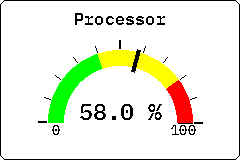 In IBM Plex Mono</td><td align="center" valign="top">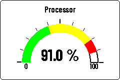 The filled arc in Barlow Condensed</td></tr>
<tr><td align="center" valign="top">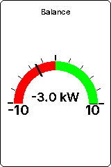 In Inter on a tall frame</td><td align="center" valign="top">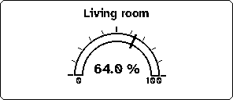 In Atkinson Hyperlegible on a tag</td></tr>
</table>

---

## School timetable

*A school week of one calendar as a table of days and lesson slots.*

| Default size | Smallest | Id |
|---|---|---|
| 800 × 480 px | 360 × 200 px | `school-timetable` |

 A school week in the colors of a Spectra 6 display

### Sources

| Source | What to pick | Per pick |
|---|---|---|
| Calendar | one calendar entity | — |

### Options

**Week**

| Option | Key | Values | Default |
|---|---|---|---|
| Days | `days` | one of `5`, `7` | `5` |
| On a weekend show | `weekend` | one of `current`, `next` | `current` |
| Day names | `dayNames` | one of `auto`, `short`, `full` | `auto` |
| 24 h clock | `use24h` | on / off | on |

**Titles**

| Option | Key | Values | Default |
|---|---|---|---|
| Short names (one "Full name = Short" per line) | `aliases` | text | empty |
| Text to remove from titles (one per line) | `stripText` | text | `[ZASTĘPSTWO]` |

**Appearance**

| Option | Key | Values | Default |
|---|---|---|---|
| Lesson in progress | `highlightColor` | color | `accent` |
| Show grid lines | `showGrid` | on / off | on |
| Grid line color | `gridColor` | color | automatic |
| Show footer | `showFooter` | on / off | on |

### Examples

<table>
<tr><td align="center" valign="top"> White text and grid lines on black, the lesson in progress in red</td><td align="center" valign="top"> A school week, the lesson in progress highlighted</td></tr>
<tr><td align="center" valign="top"> Short names and removed substitution markers</td><td align="center" valign="top"> On a BWRY display the lesson in progress is red</td></tr>
<tr><td align="center" valign="top"> Seven days</td><td align="center" valign="top"> On a weekend the next week can be shown</td></tr>
<tr><td align="center" valign="top">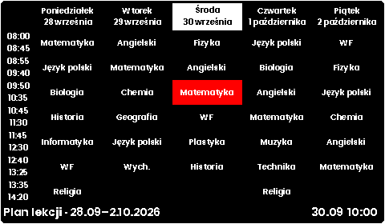 White on black without grid lines</td><td align="center" valign="top">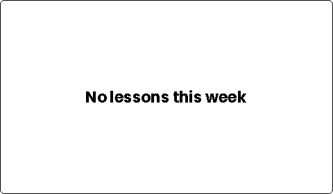 No lessons</td></tr>
<tr><td align="center" valign="top">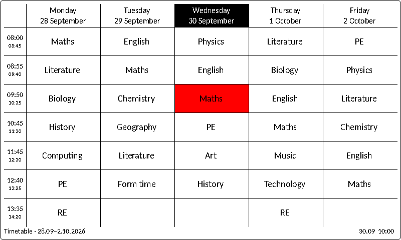 In Carlito, the look of Calibri</td><td align="center" valign="top">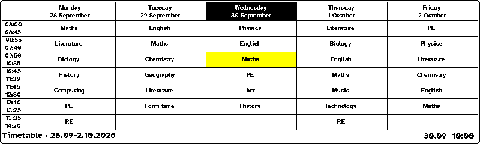 In Atkinson Hyperlegible on half of a display</td></tr>
<tr><td align="center" valign="top">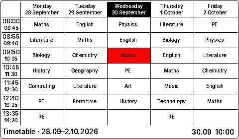 In Inter on a small frame</td></tr>
</table>

---

## Sensor card

*The value of one entity as a tile that follows the shape of its frame.*

| Default size | Smallest | Id |
|---|---|---|
| 280 × 160 px | 120 × 80 px | `sensor-card` |

 A tile in the colors of a Spectra 6 display

### Sources

| Source | What to pick | Per pick |
|---|---|---|
| Entity | one entity | Label, Icon |

### Options

**Content**

| Option | Key | Values | Default |
|---|---|---|---|
| Show icon | `showIcon` | on / off | on |
| Show name | `showName` | on / off | on |
| Show unit | `showUnit` | on / off | on |
| Decimals | `decimals` | one of `auto`, `0`, `1`, `2`, `3` | `auto` |
| Show separator | `showSeparator` | on / off | on |
| Alignment | `align` | one of `auto`, `left`, `center`, `right` | `auto` |
| Value size | `valueSize` | one of `auto`, `small`, `medium`, `large` | `auto` |

**Thresholds**

| Option | Key | Values | Default |
|---|---|---|---|
| Alert below | `alertBelow` | text | empty |
| Alert above | `alertAbove` | text | empty |
| Alert color | `alertColor` | color | `accent` |

### Examples

<table>
<tr><td align="center" valign="top"> A wide tile puts the icon on the left and the unit beside the value</td><td align="center" valign="top"> A square tile stacks icon, name, value and unit</td></tr>
<tr><td align="center" valign="top"> A tall tile is separated by a line</td><td align="center" valign="top"> White on black</td></tr>
<tr><td align="center" valign="top"> Red with yellow elements on a BWRY display</td><td align="center" valign="top"> Without frame and background</td></tr>
<tr><td align="center" valign="top">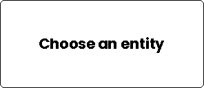 Nothing chosen yet</td><td align="center" valign="top">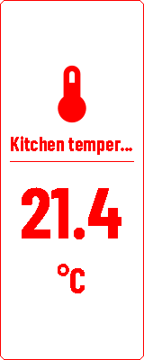 In Barlow Condensed, a big value in a narrow tile</td></tr>
<tr><td align="center" valign="top">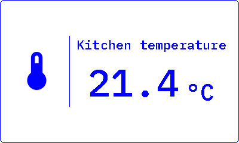 In IBM Plex Mono</td><td align="center" valign="top">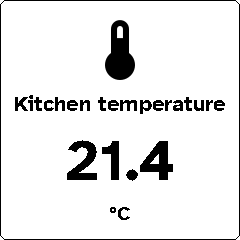 In Atkinson Hyperlegible</td></tr>
<tr><td align="center" valign="top">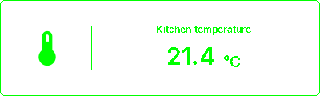 In Inter on a strip</td></tr>
</table>

---

## Sensor chart

*The value of one entity with its history as a line chart.*

| Default size | Smallest | Id |
|---|---|---|
| 385 × 225 px | 200 × 120 px | `sensor-chart` |

 A chart in the colors of a Spectra 6 display

### Sources

| Source | What to pick | Per pick |
|---|---|---|
| Entity | one entity | Label, Icon |

### Options

**Content**

| Option | Key | Values | Default |
|---|---|---|---|
| Show icon | `showIcon` | on / off | on |
| Show name | `showName` | on / off | on |
| Show unit | `showUnit` | on / off | on |
| Decimals | `decimals` | one of `auto`, `0`, `1`, `2`, `3` | `auto` |

**Chart**

| Option | Key | Values | Default |
|---|---|---|---|
| Hours to show | `hours` | number 1 to 168 | `24` |
| Smoothing | `smoothing` | on / off | on |
| Chart placement | `placement` | one of `auto`, `bottom`, `right` | `auto` |
| Show min and max | `showMinMax` | on / off | on |

**Details**

| Option | Key | Values | Default |
|---|---|---|---|
| Show type chip | `showChip` | on / off | on |
| Show entity id | `showEntityId` | on / off | on |
| Show time of the last update | `showUpdated` | on / off | on |

### Examples

<table>
<tr><td align="center" valign="top"> Full size: the chart below the value</td><td align="center" valign="top"> Half horizontal: the chart beside the value</td></tr>
<tr><td align="center" valign="top"> Half vertical</td><td align="center" valign="top"> Quadrant</td></tr>
<tr><td align="center" valign="top"> White on black</td><td align="center" valign="top"> A week, without the details</td></tr>
<tr><td align="center" valign="top"> An entity without history</td><td align="center" valign="top"> Nothing chosen yet</td></tr>
<tr><td align="center" valign="top">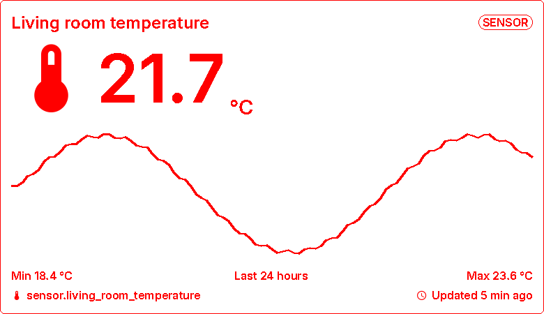 In Inter</td><td align="center" valign="top">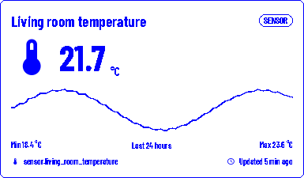 In Barlow Condensed</td></tr>
<tr><td align="center" valign="top">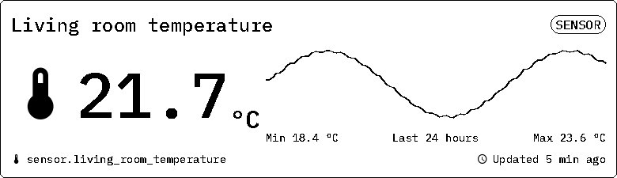 In IBM Plex Mono beside the value</td></tr>
</table>

---

## Sensor list

*The values of several entities, one line each.*

| Default size | Smallest | Id |
|---|---|---|
| 280 × 200 px | 160 × 80 px | `sensor-list` |

 A list in the colors of a Spectra 6 display

### Sources

| Source | What to pick | Per pick |
|---|---|---|
| Entities | one or more entity | Label, Icon |

### Options

**Content**

| Option | Key | Values | Default |
|---|---|---|---|
| Show icon | `showIcon` | on / off | on |
| Show name | `showName` | on / off | on |
| Show unit | `showUnit` | on / off | on |
| Decimals | `decimals` | one of `auto`, `0`, `1`, `2`, `3` | `auto` |
| Show dividers | `showDividers` | on / off | on |

**Thresholds**

| Option | Key | Values | Default |
|---|---|---|---|
| Alert below | `alertBelow` | text | empty |
| Alert above | `alertAbove` | text | empty |
| Alert color | `alertColor` | color | `accent` |

**Appearance**

| Option | Key | Values | Default |
|---|---|---|---|
| Text size | `textSize` | number 10 to 128 | automatic |

### Examples

<table>
<tr><td align="center" valign="top"> A list where one value is past its threshold</td><td align="center" valign="top"> White on black</td></tr>
<tr><td align="center" valign="top"> Without frame and dividers</td><td align="center" valign="top"> Names only in Polish</td></tr>
<tr><td align="center" valign="top"> Nothing chosen yet</td><td align="center" valign="top">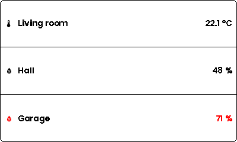 A smaller text size</td></tr>
<tr><td align="center" valign="top">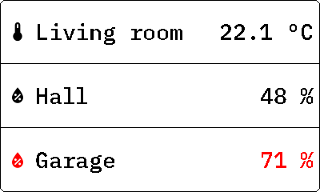 Numbers that line up in IBM Plex Mono</td><td align="center" valign="top">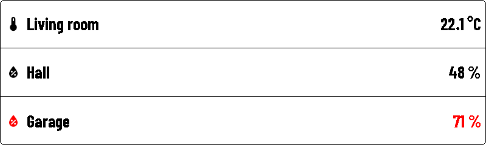 In Barlow Condensed</td></tr>
<tr><td align="center" valign="top">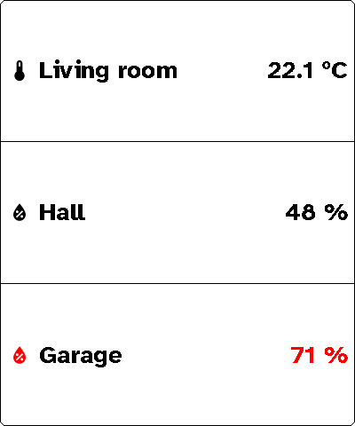 In Atkinson Hyperlegible on a tall frame</td></tr>
</table>

---

## Thermometer

*A temperature on a classic round dial with a needle.*

| Default size | Smallest | Id |
|---|---|---|
| 200 × 200 px | 96 × 96 px | `thermometer` |

 A processor, green, yellow from 60 and red from 85

Shows the value of one temperature sensor on a classic round dial, the kind that hangs
on a wall: a scale of ticks and numbers over three quarters of a circle, a needle, and
the temperature written under its hub with the name of the sensor.

**Scale** sets the lowest and the highest temperature and how far apart the numbers
are; there is a short tick between them. A temperature beyond either end is drawn at that
end. The needle takes the color you pick, the accent color of the display by default.

**Ranges** put a band of color along the edge of the dial: add one for each color and say
where it starts, and it lasts until the next one starts. Blue while cold, green at working
heat and red when too hot is a boiler; the colors are those of your display.

Several of them make a dashboard of temperatures: the outdoor and indoor temperature, the
flow and the return of a boiler, the hot water tank, the processor of a computer. Give each
its own scale. In a small frame the numbers of the scale give way first, then the name, so
the dial stays as big as it can be.

### Sources

| Source | What to pick | Per pick |
|---|---|---|
| Entity | one sensor or input_number or number entity | Label |

### Options

**Content**

| Option | Key | Values | Default |
|---|---|---|---|
| Show name | `showName` | on / off | on |
| Show value | `showValue` | on / off | on |
| Show unit | `showUnit` | on / off | on |
| Decimals | `decimals` | one of `auto`, `0`, `1`, `2`, `3` | `1` |
| Show the numbers of the scale | `showLabels` | on / off | on |

**Scale**

| Option | Key | Values | Default |
|---|---|---|---|
| Minimum | `min` | number | `-10` |
| Maximum | `max` | number | `40` |
| Distance between the numbers | `majorStep` | number | `10` |

**Ranges**

| Option | Key | Values | Default |
|---|---|---|---|
| Ranges | `ranges` | list of colored ranges | `[]` |

**Appearance**

| Option | Key | Values | Default |
|---|---|---|---|
| Needle color | `needleColor` | color | `accent` |

### Examples

<table>
<tr><td align="center" valign="top"> The classic dial: a scale from -10 to 40 and a needle</td><td align="center" valign="top"> Below zero, with a band of color: blue below zero, green, red from 30</td></tr>
<tr><td align="center" valign="top"> The flow of a central heating boiler: blue while cold, green at working heat, red when too hot</td><td align="center" valign="top"> Hot water in a tank, in whole degrees, with the safe range in green</td></tr>
<tr><td align="center" valign="top"> Degrees Fahrenheit</td><td align="center" valign="top"> Without the numbers of the scale</td></tr>
<tr><td align="center" valign="top"> A small frame keeps the dial and the value</td><td align="center" valign="top"> On a wide tag, in Polish</td></tr>
<tr><td align="center" valign="top"> White on black, without the frame</td><td align="center" valign="top"> Nothing chosen yet</td></tr>
<tr><td align="center" valign="top">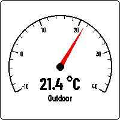 In Barlow Condensed</td><td align="center" valign="top">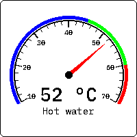 In IBM Plex Mono</td></tr>
<tr><td align="center" valign="top">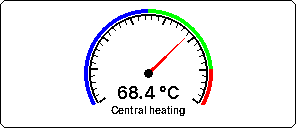 In Inter on a wide frame</td><td align="center" valign="top">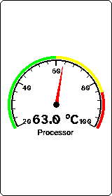 In Atkinson Hyperlegible, the processor</td></tr>
</table>

---

## Waste collection

*When each bin is collected, from up to four calendars, with the nearest dates highlighted.*

| Default size | Smallest | Id |
|---|---|---|
| 296 × 128 px | 160 × 96 px | `waste-collection` |

 Four bins in the colors of a Spectra 6 display

Shows when each of up to four bins is collected, one cell for each. Pick the calendars
of your waste collection (one per bin) and give each a label; the date comes from the
next event of the calendar, in words ("Today", "Tomorrow", "in 12 days") in the language
of the dashboard.

A bin that is due within **Highlight this many days before** is filled with the
highlight color and its text turns to the color of the background. The highlight color is
one for all bins and can be set for each bin as well. The cells follow the shape of the
frame: two by two, or in one row or one column for a very wide or tall frame, and the
bin in the middle appears where four cells meet. The sizes of the texts come from the
frame, not from the dates, so the cells line up whatever the dates are.

### Sources

| Source | What to pick | Per pick |
|---|---|---|
| Bins | one or more calendar entity | Label, Highlight color |

### Options

**Content**

| Option | Key | Values | Default |
|---|---|---|---|
| Highlight this many days before | `highlightDays` | number 0 to 30 | `1` |
| Highlight color | `alertColor` | color | `accent` |
| Show the bin in the middle | `showIcon` | on / off | on |
| Show dividers | `showDividers` | on / off | on |

### Examples

<table>
<tr><td align="center" valign="top"> Four bins on a small tag, the one due tomorrow highlighted</td><td align="center" valign="top"> The same on a full display</td></tr>
<tr><td align="center" valign="top"> A narrow frame puts the bins in a column</td><td align="center" valign="top"> A wide frame puts them in a row</td></tr>
<tr><td align="center" valign="top"> Three bins</td><td align="center" valign="top"> Two bins in German</td></tr>
<tr><td align="center" valign="top"> A highlight color for each bin on a BWRY display</td><td align="center" valign="top"> White on black, without the bin in the middle</td></tr>
<tr><td align="center" valign="top">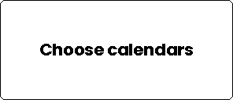 Nothing chosen yet</td><td align="center" valign="top">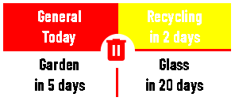 In Barlow Condensed</td></tr>
<tr><td align="center" valign="top">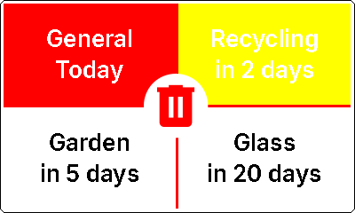 In Inter on a quadrant</td><td align="center" valign="top">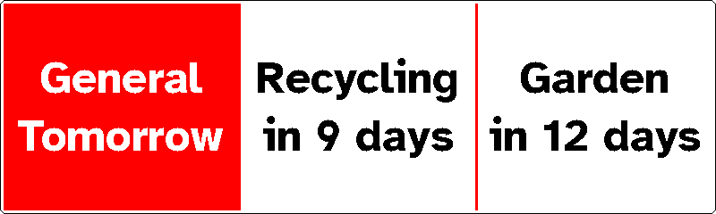 In Atkinson Hyperlegible, three bins</td></tr>
</table>

---

## Weather

*Current conditions and a daily or hourly forecast of a weather entity.*

| Default size | Smallest | Id |
|---|---|---|
| 360 × 200 px | 160 × 100 px | `weather` |

 Daily forecast in the colors of a Spectra 6 display

### Sources

| Source | What to pick | Per pick |
|---|---|---|
| Weather entity | one weather entity | — |

### Options

**Forecast**

| Option | Key | Values | Default |
|---|---|---|---|
| Forecast | `forecastType` | one of `daily`, `hourly` | `daily` |
| Number of forecast items | `forecastItems` | number 1 to 8 | `5` |

**Details**

| Option | Key | Values | Default |
|---|---|---|---|
| Decimals | `decimals` | one of `auto`, `0`, `1`, `2`, `3` | `auto` |
| Show humidity | `showHumidity` | on / off | on |
| Show feels like | `showFeelsLike` | on / off | off |
| Show wind | `showWind` | on / off | off |

### Examples

<table>
<tr><td align="center" valign="top"> Daily forecast</td><td align="center" valign="top"> White on black</td></tr>
<tr><td align="center" valign="top"> Square corners</td><td align="center" valign="top"> Without frame and background</td></tr>
<tr><td align="center" valign="top"> Hourly forecast with details</td><td align="center" valign="top"> Small frame</td></tr>
<tr><td align="center" valign="top">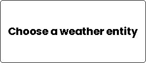 Nothing chosen yet</td><td align="center" valign="top">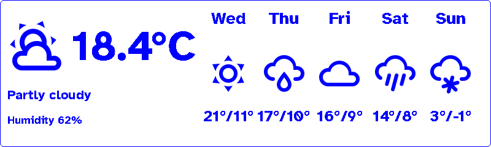 In Atkinson Hyperlegible</td></tr>
<tr><td align="center" valign="top">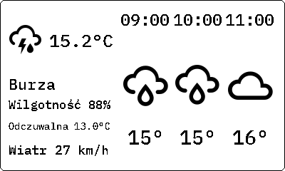 The hourly forecast in IBM Plex Mono</td><td align="center" valign="top">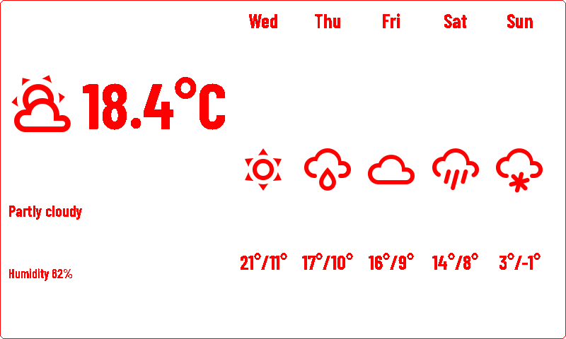 The daily forecast in Barlow Condensed</td></tr>
<tr><td align="center" valign="top">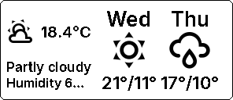 In Inter on a small frame</td></tr>
</table>
